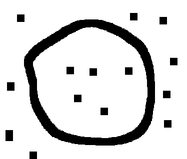
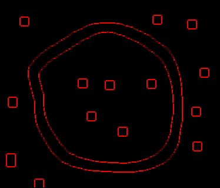
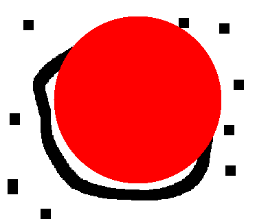

Projet PACT Télécom ParisTech
-----------------------------

**Traitement d'images**

Implémentation d'une estimation d'un cercle à partir d'une liste de points via un algorithme robuste RANSAC(1).

Obtention de cette liste de point sur une image à partir d'une estimation de contours suivant deux algorithmes:
  * Algorithme par gradient avec le filtre de SOBEL(2)
  * Algorithme par gradient avec le filtre de CANNY(3)
  
Voici ce que fournit le programme sur une image test

Après passage du filtre de SOBEL

Après passage de RANSAC, détection du cercle, et découpage de l'image de contours autour de celui ci

![]!(testResult2.png)

Le tracé du cercle sur l'image initiale

Références:
* (1): http://en.wikipedia.org/wiki/RANSAC
* (2): http://en.wikipedia.org/wiki/Sobel_operator
* (3): http://en.wikipedia.org/wiki/Canny_edge_detector

Remerciements:
A Tom Gibara dont l'implémentation de la détection de contours à l'aide du filtre de CANNY (disponible sur ce dépôt) m'a donné des idées de structure pour l'implémentation de la détections de contours à l'aide du filtre de SOBEL.
